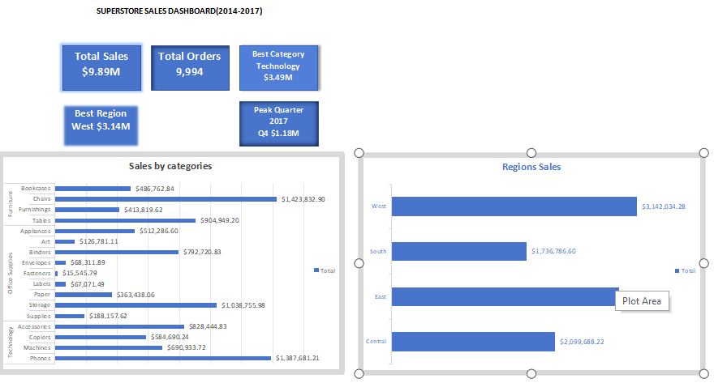
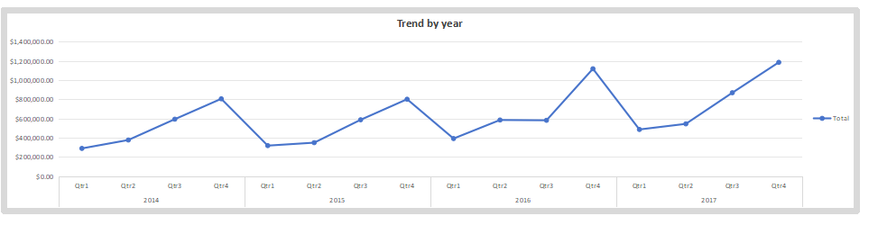

# Superstore-sales-dashboard
Superstore Sales Analysis 2014-2017 | Excel Dashboard with KPIs, Regional & Category Performance and Trend Analysis

## 📊 Dashboard Preview

### 1. KPI Overview, Category & Region Performance

**Key Insights:**
- Total Sales: $9.89M | Total Orders: 9,994
- Top Category: Technology ($3.49M)
- Top Region: West ($3.14M)

### 2. Sales Trend Analysis 2014-2017

**Trend Insight:** Sales showed consistent growth with peak performance in Q4 2017 ($1.18M)

## 🛠️ Tools Used
- Microsoft Excel (PivotTable, PivotChart, Slicers)

## 📁 Files
- Superstore_Sales_Dashboard.xlsx
- KPI_Category_Region_Dashboard.png
- trend.png

Built by Iyanuoluwa — Aspiring Data Analyst
